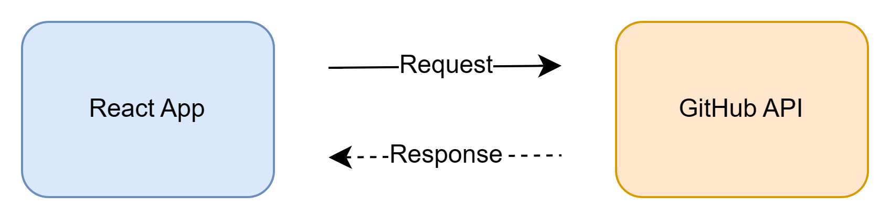
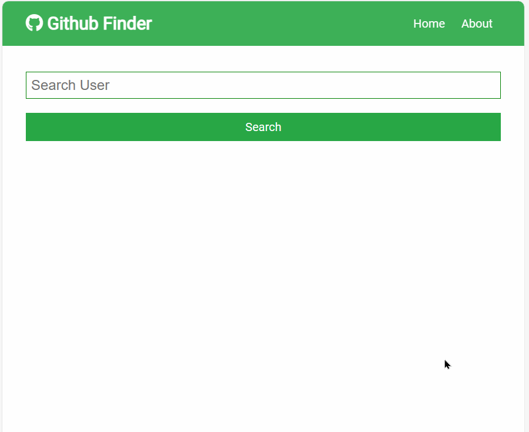
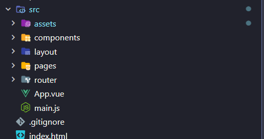
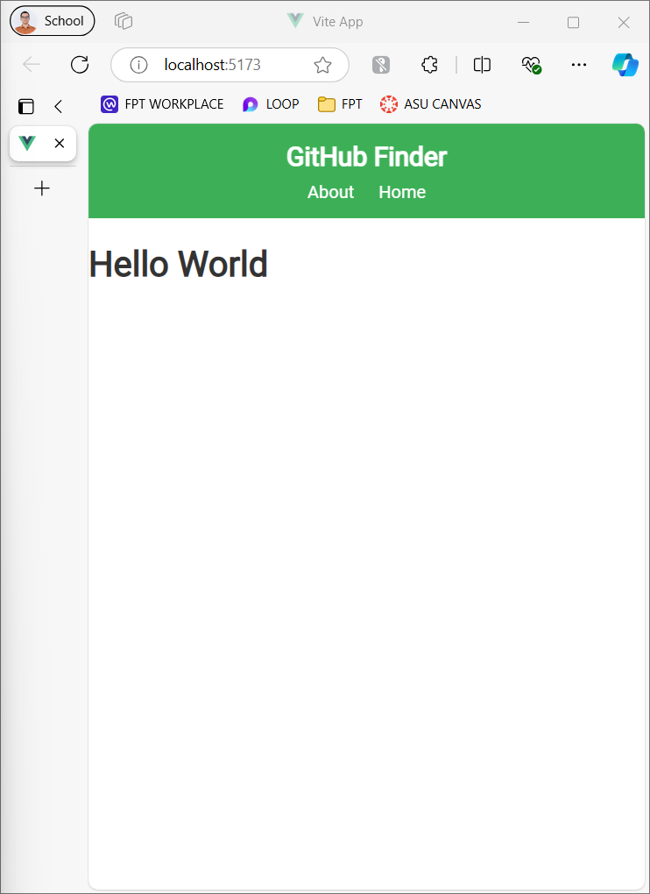
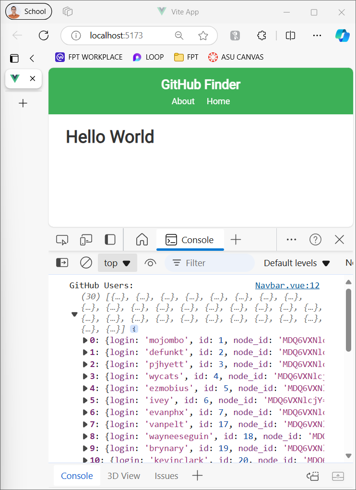
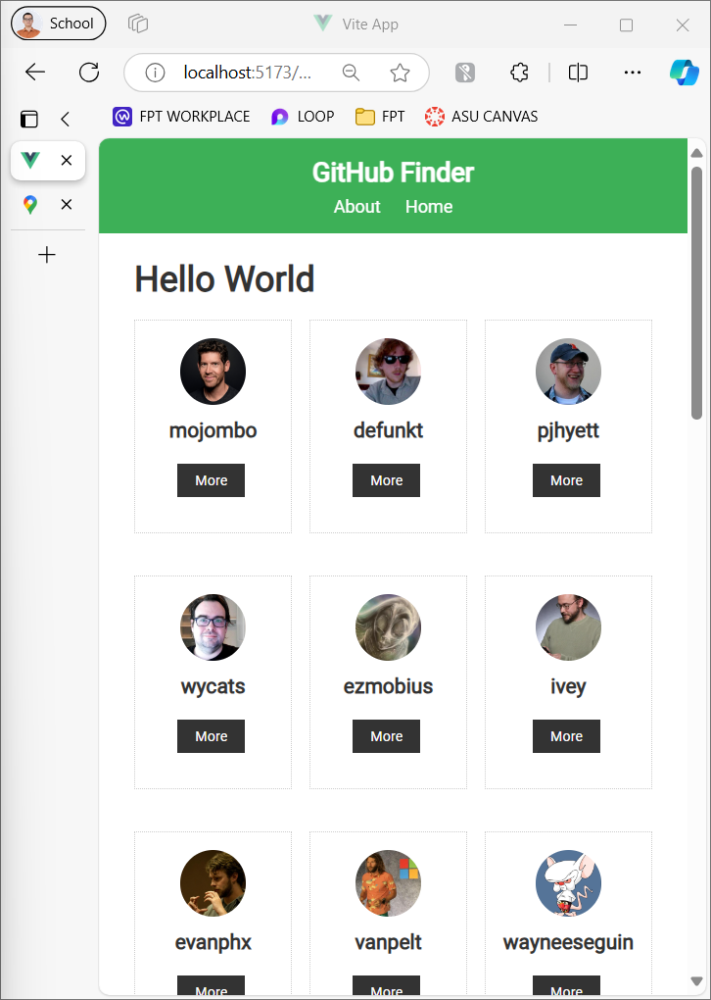
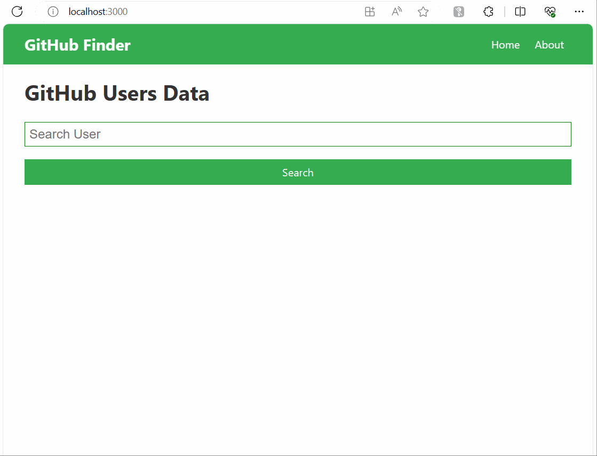
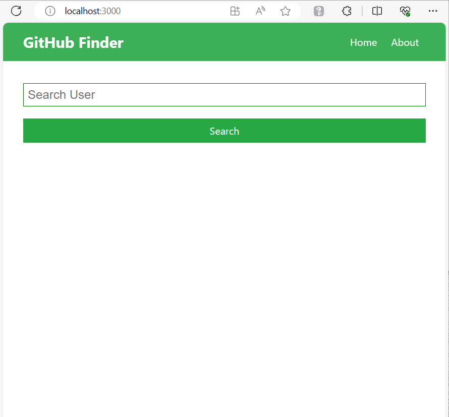
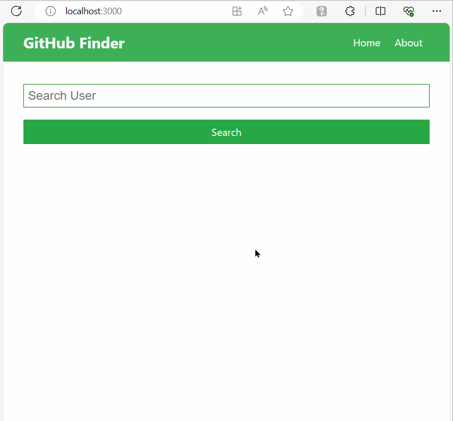
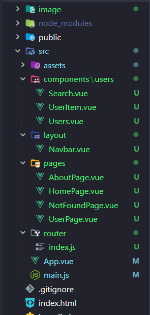

# comp1842-vue-github-finder

## What does it do?

It searches for all the Github users using the text inputted by the user in the form. It returns all the users matching the string in a grid format. Clicking on the `more` tab takes the user to a custom made page with the vital stats.

## Archiecture Overall


In this project, we will create a Vue App and use GitHub API to search information then display it


We will use following endpoints from GitHub API to make requests

```bash
GET https://api.github.com/users/                 # Get list of Users
GET https://api.github.com/users/:username        # Get user information by name
GET https://api.github.com/users/:username/repos  # Get repos information by name
GET https://api.github.com/search/users?q=search  # Search users
```

## Setup CSS

To speed up the development time, we use the provided App.css on the file `/src/assets/main.css`.

This will contains all needed styling

## Project Structure

Now, folder structure is very crucial. You will setup the folder structure like this.



## Create NavBar Component

Now, it's time to create our first component. We will create the `Navbar` component then place it on `/src/layout/Navbar.vue`

```vue
<script setup></script>

<template>
  <nav className="navbar bg-success">
    <h1><i className="fab fa-github" /> GitHub Finder</h1>
    <ul>
      <li>
        <a href="/#">About</a>
        <a href to="/">Home</a>
      </li>
    </ul>
  </nav>
</template>
```

Then, update the `App.vue` to display the Navbar

```vue
<!-- App.vue -->
<script setup lang="ts">
import Navbar from "./layout/Navbar.vue";
</script>

<template>
  <Navbar />
  <div class="container">
    <h1>Hello World</h1>
  </div>
</template>
```

This is the result after run the server.



## Use `onMounted` to fetch data with `axios`

To fetch data, we will use `axios` to make request.

Use the following command to install it

```bash
npm install axios
```

Great. We will update the `App.vue` file to fetch the data then display on the console first.

```vue
<script setup lang="ts">
import axios from "axios";
import { onMounted } from "vue";
import Navbar from "./layout/Navbar.vue";

onMounted(() => {
  const fetchData = async () => {
    try {
      // Use the 'axios' library to make a GET request to the GitHub API endpoint
      const response = await axios.get("https://api.github.com/users");

      // Log the fetched data to the console
      console.log("GitHub Users:", response.data);
    } catch (error) {
      // Log an error message if there's an issue fetching data
      console.error("Error fetching data:", error);
    }
  };

  // Call the 'fetchData' function when the component mounts
  fetchData();
});
</script>

<template>
  <Navbar />
  <div class="container">
    <h1>Hello World</h1>
  </div>
</template>
```

Now, we you reload the app, you can see the data being fetch



## Create `Users` and `UserItem` component to display all information

Now, we will create `Users` and `UserItem` to display all data.

First, we will create the `UserItem` first.

```vue
<!-- /src/components/users/UserItem.vue -->
<script setup>
const props = defineProps({
  user: {
    type: Object,
    required: true,
  },
});
</script>

<template>
  <div class="card text-center">
    
    <h3>{{ user.login }}</h3>
    <div>
      <a href="#" class="btn btn-dark btn-sm my-1"> More </a>
    </div>
  </div>
</template>

<style scoped>
.round-img {
  border-radius: 50%;
}
</style>
```

Then, create `Users` components.

```vue
<!-- /src/components/users/Users.vue -->
<script setup>
import UserItem from "./UserItem.vue";

const props = defineProps({
  users: {
    type: Array,
    required: true,
  },
});

const userStyle = {
  display: "grid",
  gridTemplateColumns: "repeat(3, 1fr)",
  gridGap: "1rem",
};
</script>

<template>
  <div :style="userStyle">
    <UserItem v-for="user in users" :key="user.id" :user="user" />
  </div>
</template>

<style scoped>
/* Add any specific styles here if needed */
</style>
```

Now, we will update the `App.vue` file to user Users component

```vue
<script setup lang="ts">
import axios from "axios";
import { onMounted, ref } from "vue";
import Users from "./components/users/Users.vue";
import Navbar from "./layout/Navbar.vue";

const users = ref([]);

onMounted(() => {
  const fetchData = async () => {
    try {
      // Use the 'axios' library to make a GET request to the GitHub API endpoint
      const response = await axios.get("https://api.github.com/users");

      // Log the fetched data to the console
      console.log("GitHub Users:", response.data);

      // Update the 'users' ref with the fetched data
      users.value = response.data;
    } catch (error) {
      // Log an error message if there's an issue fetching data
      console.error("Error fetching data:", error);
    }
  };

  // Call the 'fetchData' function when the component mounts
  fetchData();
});
</script>

<template>
  <Navbar />
  <div class="container">
    <h1>Hello World</h1>
    <Users :users="users" />
  </div>
</template>
```

Reload the app to see the result



## Feature: Search

Now, we will create the `Search` component to handle the input then fetch the api.

Steps will be:

- User will input to `Search` component then submit
- Fetch the data
- Display the response with `Users` component

## Create the `Search` component

You will create it on `/src/components/users`

```vue
<!-- /src/components/users/Search.vue -->
<script setup>
import { ref } from "vue";
import axios from "axios";
import Users from "./Users.vue";

const text = ref("");
const users = ref([]);

const searchUsers = async (searchText) => {
  try {
    const response = await axios.get(
      `https://api.github.com/search/users?q=${searchText}`
    );
    users.value = response.data.items;
  } catch (error) {
    console.error("Error fetching data:", error);
  }
};

const onSubmit = () => {
  if (text.value === "") {
    alert("Please enter something");
  } else {
    searchUsers(text.value);
    text.value = "";
  }
};
</script>

<template>
  <div>
    <form @submit.prevent="onSubmit" class="form">
      <input type="text" name="text" placeholder="Search User" v-model="text" />
      <input type="submit" value="Search" class="btn btn-success btn-block" />
    </form>
    <Users :users="users" />
  </div>
</template>

<style scoped>
/* Add any specific styles if needed */
</style>
```

Update the `App.vue` to include the `Search` component

```vue
<script setup lang="ts">
import Search from "./components/users/Search.vue";
import Navbar from "./layout/Navbar.vue";
</script>

<template>
  <Navbar />
  <div class="container">
    <h1>Hello World</h1>
    <Search />
  </div>
</template>
```

You can see the application now has a search input then it will display the search result for us.



Now, we will add a Clear button to clear all search results

```vue
<script setup>
import axios from "axios";
import { ref } from "vue";
import Users from "./Users.vue";

const text = ref("");
const users = ref([]);

// ... Rest of the function

const clearUsers = () => {
  users.value = [];
};
</script>

<template>
  <div>
    <!-- Rest of the form -->
    <button
      @click="clearUsers"
      v-if="users.length > 0"
      class="btn btn-block btn-danger"
    >
      Clear
    </button>

    <Users :users="users" />
  </div>
</template>

<style scoped>
/* Add any specific styles if needed */
</style>
```

## Setup Vue Router

If you have an existing project that uses a JavaScript package manager, you can install Vue Router from the npm registry:

```bash
npm install vue-router@4
```

First, we will create `HomePage`, `NotFoundPage`, `AboutPage`.

```vue
<!-- /src/pages/HomePage.vue -->
<script setup>
import Search from "../components/users/Search.vue";
</script>

<template>
  <Search />
</template>
```

```vue
<!-- /src/pages/AboutPage.vue -->
<template>
  <h1>About Page</h1>
  <p>
    Lorem, ipsum dolor sit amet consectetur adipisicing elit. Quasi blanditiis
    eaque quos maiores molestiae facilis quam! Expedita, velit sapiente? Natus
    magni nisi, est delectus quas qui unde quo sit ea.
  </p>
</template>
```

```vue
<!-- /src/pages/NotFoundPage.vue -->
<template>
  <h1>404 Page Not Found</h1>
</template>
```

Then, we will create the Router for the app in `router` folder

```js
// /src/router/index.js

import { createRouter, createWebHistory } from "vue-router";

import AboutView from "../pages/AboutPage.vue";
import HomeView from "../pages/HomePage.vue";
import NotFoundPage from "../pages/NotFoundPage.vue";

const routes = [
  { path: "/", component: HomeView },
  { path: "/about", component: AboutView },
  { path: "/:pathMatch(.*)*", component: NotFoundPage },
];

const router = createRouter({
  history: createWebHistory(),
  routes,
});

export default router;
```

After that, use `router` in the `main.js`

```js
// main.js
import "./assets/main.css";

import { createApp } from "vue";
import App from "./App.vue";
import router from "./router/index.js";

createApp(App).use(router).mount("#app");
```

Make sure to update `App.vue` to use `RouterView`

```vue
<!-- App.vue -->
<script setup lang="ts">
import Navbar from "./layout/Navbar.vue";
</script>

<template>
  <Navbar />
  <div class="container">
    <RouterView />
  </div>
</template>
```

Modify `Navbar.vue` to use `RouterLink`

```vue
<!-- /src/components/layout/Navbar.vue -->
<script setup>
import { RouterLink } from "vue-router";
</script>

<template>
  <nav className="navbar bg-success">
    <h1><i className="fab fa-github" /> GitHub Finder</h1>
    <ul>
      <li>
        <RouterLink to="/about">About</RouterLink>
        <RouterLink to="/">Home</RouterLink>
      </li>
    </ul>
  </nav>
</template>
```

Now, the application has multiple pages



## Create `UserPage` component to display all user information

After we search the user, we want to see all information of selected one.

Now, we will create the `UserPage` component to (1) fetch the data then (2) display all of it.

First, update `router/index.js` to specify the routing

```js
// /src/router/index.js
import { createRouter, createWebHistory } from "vue-router";

import AboutPage from "../pages/AboutPage.vue";
import HomePage from "../pages/HomePage.vue";
import NotFoundPage from "../pages/NotFoundPage.vue";
import UserPage from "../pages/UserPage.vue";

const routes = [
  { path: "/", component: HomePage },
  { path: "/about", component: AboutPage },
  { path: "/:pathMatch(.*)*", component: NotFoundPage },
  { path: "/user/:id", component: UserPage },
];

const router = createRouter({
  history: createWebHistory(),
  routes,
});

export default router;
```

Then, we have to update the `UserItem` a bit to use the `RouterLink`

```vue
<!-- /src/components/users/UserItem.vue -->
<script setup>
const props = defineProps({
  user: {
    type: Object,
    required: true,
  },
});
</script>

<template>
  <div class="card text-center">
    
    <h3>{{ user.login }}</h3>
    <div>
      <!-- Use RouterLink here -->
      <RouterLink :to="`/user/${user.login}`" class="btn btn-dark btn-sm my-1">
        More
      </RouterLink>
    </div>
  </div>
</template>

<style scoped>
.round-img {
  border-radius: 50%;
}
</style>
```

Now, we can create the `UserPage` component

```vue
<!-- /src/pages/UserPage.vue -->
<script setup>
import { ref, onMounted } from "vue";
import { useRoute } from "vue-router";
import axios from "axios";

const route = useRoute();
const user = ref({});
const repos = ref([]);
const hireable = ref(false);

const getUser = async (username) => {
  try {
    const response = await axios.get(
      `https://api.github.com/users/${username}`
    );
    user.value = response.data;
    hireable.value = response.data.hireable;
  } catch (error) {
    console.error("Error fetching user data:", error.message);
  }
};

const getUserRepos = async (username) => {
  // Example for students to implement fetching user repositories
  try {
    const response = await axios.get(
      `https://api.github.com/users/${username}/repos`
    );
    repos.value = response.data;
  } catch (error) {
    console.error("Error fetching repos:", error.message);
  }
};

onMounted(() => {
  const { id } = route.params;
  getUser(id);
  getUserRepos(id);
});
</script>

<style scoped>
.round-img {
  border-radius: 50%;
}
</style>

<template>
  <div>
    <router-link to="/" class="btn btn-light">Back to Home</router-link>
    Hireable:
    <i
      :class="
        hireable
          ? 'fas fa-check text-success'
          : 'fas fa-times-circle text-danger'
      "
    ></i>

    <div class="card grid-2">
      <div class="all-center">
        
        <h1>{{ user.name }}</h1>
        <p>{{ user.location }}</p>
      </div>
      <div>
        <div v-if="user.bio">
          <h3>Bio:</h3>
          <p>{{ user.bio }}</p>
        </div>
        <a
          :href="user.html_url"
          class="btn btn-dark my-1"
          target="_blank"
          rel="noopener noreferrer"
        >
          Show Github Profile
        </a>
        <ul>
          <li v-if="user.login"><strong>Username: </strong>{{ user.login }}</li>
          <li v-if="user.company">
            <strong>Company: </strong>{{ user.company }}
          </li>
          <li v-if="user.blog">
            <strong>Website: </strong>
            <a :href="user.blog" target="_blank" rel="noopener noreferrer">{{
              user.blog
            }}</a>
          </li>
        </ul>
      </div>
    </div>
    <div class="card text-center">
      <div class="badge badge-primary">Followers: {{ user.followers }}</div>
      <div class="badge badge-success">Following: {{ user.following }}</div>
      <div class="badge badge-light">Repository: {{ user.public_repos }}</div>
      <div class="badge badge-dark">Gist: {{ user.public_gists }}</div>
    </div>
  </div>
</template>
```

Let's see the result



Below is the final folder application structure



# EXERCISE

- [ ] `Refactor:` create the `api.js` file to handle all API requests and use it to call API instead of using plain `axios`
- [ ] `Refactor:` Refactor the code to include the search options in the URL of the search page, so that when the user come back from user page to seah page, he does not loose the previous settings.
- [ ] `Task:` Create `Repos` and `RepoItem` components. It will be used to display the Repos information and is included in `User` component
- [ ] `Task:` Implement Dark theme / Light theme mechanic
